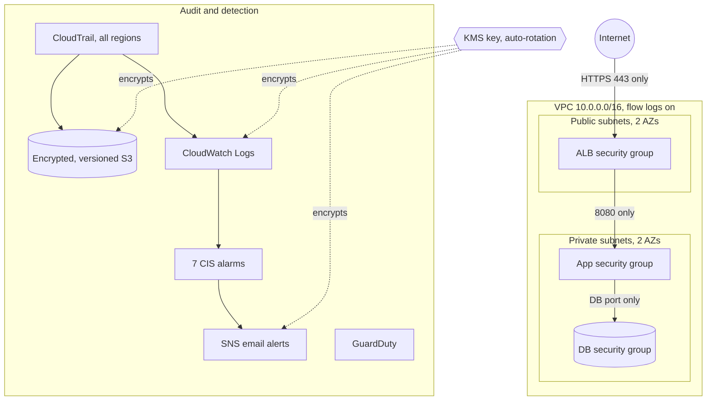

# AWS Secure Landing Zone (Terraform)

A production-ready, secure-by-default AWS foundation you can deploy in one command. It gives a new or existing AWS account the network, logging, encryption and alerting baseline that security reviews and compliance frameworks (CIS AWS Foundations, SOC 2) expect.

**Checkov result:** 179 checks passed, 0 failed. The 12 skipped checks each have a written reason next to the code.

## The problem it solves

Most AWS accounts start with default settings: no audit trail, public subnets everywhere, unencrypted logs, and nobody notified when the root user signs in. Fixing that by hand is slow and easy to get wrong. This project applies a reviewed baseline as code, so it is repeatable across dev, staging and production.

## Architecture



## What it deploys

| Area | Controls |
|---|---|
| Network | VPC across 2 or 3 AZs; public subnets for load balancers only; private subnets for apps and databases; no automatic public IPs; optional NAT gateway |
| Segmentation | Three-tier security groups (ALB, app, DB), each accepting traffic only from the tier in front of it; default security group stripped of all rules |
| Audit logging | Multi-region CloudTrail with log file integrity validation; VPC flow logs for all traffic |
| Log storage | Dedicated S3 bucket: KMS encryption, versioning, ACLs disabled, HTTPS-only policy, Glacier after 90 days |
| Encryption | Customer-managed KMS key with yearly rotation and a least-privilege key policy; EBS encryption on by default |
| Detection | GuardDuty; CloudWatch alarms for root account use, console login without MFA, unauthorized API calls, IAM policy changes, CloudTrail tampering, security group changes, KMS key deletion |
| Identity | Strict IAM password policy (14+ chars, complexity, 24-password history, 90-day rotation) |
| Account guardrails | S3 Block Public Access for the entire account |

## Deploy

Requirements: Terraform 1.5+, AWS CLI configured with admin rights on the target account.

```bash
cp terraform.tfvars.example terraform.tfvars   # set alert_email and region
terraform init
terraform plan
terraform apply
```

Confirm the SNS subscription email AWS sends you, or alarms will not reach you.

## Verify it works

```bash
# CloudTrail is logging and validating
aws cloudtrail get-trail-status --name secure-lz-dev-trail

# Account-wide S3 public access block
aws s3control get-public-access-block --account-id $(aws sts get-caller-identity --query Account --output text)

# Scan the code yourself
pip install checkov && checkov -d .
```

To test an alarm, sign in to the console as the root user. Within about 5 minutes you get a "root-account-usage" email.

## Cost

With the NAT gateway off (default), an idle account costs roughly **$3-10 per month**: about $1 for the KMS key, $0.70 for seven alarms, and small amounts for log storage. GuardDuty is free for 30 days, then priced by data volume. The first CloudTrail trail's management events are free. Turning on the NAT gateway adds about $32 per month plus data processing.

## Design decisions

- **One trail, all regions.** Attackers often work in regions nobody watches. A single multi-region trail covers them all.
- **NAT off by default.** It is the most expensive item and many workloads use VPC endpoints instead.
- **Alarms over dashboards.** A dashboard nobody opens catches nothing. These alarms send email the moment a high-risk event happens.

## Clean up

```bash
terraform destroy
```

The CloudTrail bucket has `force_destroy = false` to protect audit logs. Empty it first if you really want it gone.

## License

MIT
